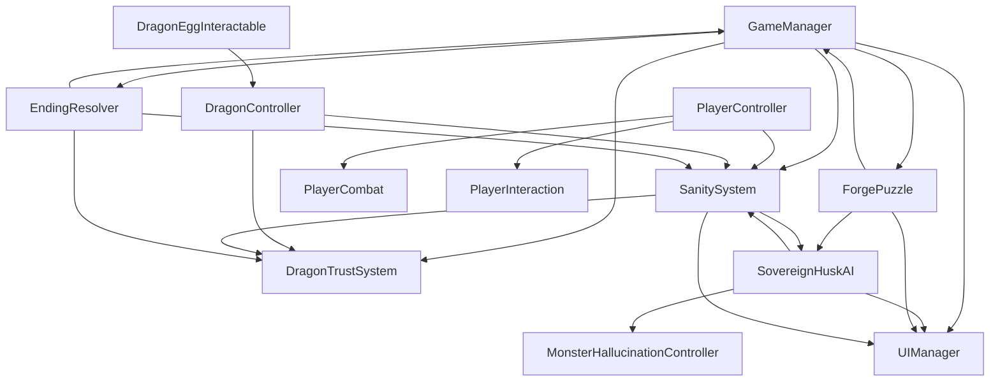

# Ashfall: The Last Ember (Working Project for **"An Answer"**) 

This document is a complete, beginner-friendly Unity architecture and implementation plan for a 10–15 minute singleplayer horror game.

- **Internal project codename:** An Answer
- **Displayed game title:** Ashfall: The Last Ember
- **Engine target:** Unity 2022 LTS+ (URP or Built-in Render Pipeline)

---

## 1) High-Level Game Architecture

### 1.1 Core Pillars

1. **Psychological Horror:** sanity drain, hallucinations, fake doors, UI glitches.
2. **Creature Horror:** The Sovereign Husk roams, stalks, disappears/reappears.
3. **Combat Horror:** very limited ammo can only **stun** the monster briefly.
4. **Emotional Companion:** bond with one dragon egg; trust impacts outcomes.
5. **Short Narrative Arc:** 10–15 minutes with one connected academy map.

### 1.2 Single Connected Map (Zones)

```
[Entrance Hall] -- [Library] -- [Dragon Forge] -- [Hatchery] -- [Vault]
      |                |              |               |            |
   Safe-ish         Clues         ATC Puzzle       Dragon       Final
   tutorial        + lore         unlock gate      bonding      ritual/chase
```

### 1.3 Unity Scene Strategy

Use **one playable scene** to keep load times and complexity low:

- `MainMenu` (optional)
- `Academy_Main` (all zones connected)
- `EndingScene` (optional, or keep ending UI in `Academy_Main`)

Recommended for beginners: keep everything in **Academy_Main** and display ending panel overlays.

---

## 2) Project Folder Layout (Unity)

```
Assets/
  _Project/
    Scripts/
      Core/
        GameManager.cs
        EndingResolver.cs
        GameEvents.cs
      Player/
        PlayerController.cs
        PlayerCombat.cs
        PlayerInteraction.cs
      Monster/
        SovereignHuskAI.cs
        MonsterHallucinationController.cs
      Dragon/
        DragonController.cs
        DragonTrustSystem.cs
        DragonEggInteractable.cs
      Systems/
        SanitySystem.cs
        ForgePuzzle.cs
        DoorLock.cs
        ZoneTrigger.cs
      UI/
        UIManager.cs
        UIGlitchController.cs
        PuzzleUI.cs
    Prefabs/
      Player/
      Monster/
      Dragons/
      Interactables/
      UI/
    Audio/
    Materials/
    Lighting/
    ScriptableObjects/
```

---

## 3) Architecture Diagram (Classes + Relationships)



---

## 4) Gameplay Loop (10–15 min)

1. **Entrance Hall (2 min):** movement + interaction tutorial, first eerie signs.
2. **Library (2–3 min):** collect lore notes + clues about “100 rounds” and costs.
3. **Dragon Forge (2–3 min):** solve ATC puzzle.
4. **Hatchery (2 min):** choose dragon egg (Ember/Mist/Volt).
5. **Vault + Final Sequence (3–5 min):** chase + ritual + ending resolution.

---

## 5) C# Scripts (Modular, Commented, Beginner Friendly)

> These scripts are intentionally compact and readable. You can expand them later.

## 5.1 `GameEvents.cs`
**Attach:** No GameObject needed (static event hub).

```csharp
using System;

public static class GameEvents
{
    public static Action<float> OnSanityChanged;
    public static Action<float> OnHealthChanged;

    public static Action OnForgeSolved;
    public static Action OnForgeFailed;

    public static Action OnDragonBonded;
    public static Action OnSanityZero;

    public static Action OnFinalVaultStarted;
    public static Action<string> OnEndingTriggered;
}
```

## 5.2 `GameManager.cs`
**Attach to:** `GameManager` empty object in `Academy_Main` scene.

```csharp
using UnityEngine;

public class GameManager : MonoBehaviour
{
    public static GameManager Instance;

    [Header("Core State")]
    public bool forgeSolved;
    public bool dragonBonded;
    public bool vaultStarted;
    public bool banishRitualCompleted;
    public bool discoveredOriginalDragonTruth;

    [Header("References")]
    public EndingResolver endingResolver;
    public DoorLock hatcheryDoor;

    private void Awake()
    {
        if (Instance == null) Instance = this;
        else Destroy(gameObject);
    }

    private void OnEnable()
    {
        GameEvents.OnForgeSolved += HandleForgeSolved;
        GameEvents.OnDragonBonded += HandleDragonBonded;
        GameEvents.OnFinalVaultStarted += HandleFinalVaultStarted;
    }

    private void OnDisable()
    {
        GameEvents.OnForgeSolved -= HandleForgeSolved;
        GameEvents.OnDragonBonded -= HandleDragonBonded;
        GameEvents.OnFinalVaultStarted -= HandleFinalVaultStarted;
    }

    private void HandleForgeSolved()
    {
        forgeSolved = true;
        if (hatcheryDoor != null) hatcheryDoor.Unlock();
    }

    private void HandleDragonBonded() => dragonBonded = true;
    private void HandleFinalVaultStarted() => vaultStarted = true;

    public void ResolveEnding(float finalSanity, float dragonTrust, string dragonType)
    {
        string ending = endingResolver.DecideEnding(
            finalSanity,
            dragonTrust,
            forgeSolved,
            banishRitualCompleted,
            discoveredOriginalDragonTruth,
            dragonType
        );

        GameEvents.OnEndingTriggered?.Invoke(ending);
    }
}
```

## 5.3 `EndingResolver.cs`
**Attach to:** same `GameManager` object.

```csharp
using UnityEngine;

public class EndingResolver : MonoBehaviour
{
    [Header("Thresholds")]
    [Range(0f, 100f)] public float highTrustThreshold = 70f;

    public string DecideEnding(
        float sanity,
        float dragonTrust,
        bool forgeSolved,
        bool ritualCompleted,
        bool knowsTruth,
        string dragonType)
    {
        // 1) Corruption if sanity reaches zero in final phase
        if (sanity <= 0f)
            return "Corruption Ending";

        // 2) Reunion if truth discovered + specific emotional alignment
        if (knowsTruth && dragonType == "Mist Wyrm" && dragonTrust >= highTrustThreshold)
            return "Reunion Ending";

        // 3) Banish if puzzle solved + ritual done + trust high
        if (forgeSolved && ritualCompleted && dragonTrust >= highTrustThreshold)
            return "Banish the Husk";

        // 4) Fallback
        return "Escape Only";
    }
}
```

## 5.4 `SanitySystem.cs`
**Attach to:** Player object.

```csharp
using UnityEngine;

public class SanitySystem : MonoBehaviour
{
    [Range(0f, 100f)] public float sanity = 100f;
    public float darknessDrainPerSecond = 2f;
    public float monsterDrainPerSecond = 5f;

    [Header("Runtime")]
    public bool inDarkness;
    public bool nearMonster;

    private bool firedZeroEvent;

    private void Update()
    {
        float drain = 0f;
        if (inDarkness) drain += darknessDrainPerSecond;
        if (nearMonster) drain += monsterDrainPerSecond;

        if (drain > 0f)
        {
            ModifySanity(-drain * Time.deltaTime);
        }
    }

    public void ModifySanity(float amount)
    {
        sanity = Mathf.Clamp(sanity + amount, 0f, 100f);
        GameEvents.OnSanityChanged?.Invoke(sanity);

        if (!firedZeroEvent && sanity <= 0f)
        {
            firedZeroEvent = true;
            GameEvents.OnSanityZero?.Invoke();
        }
    }
}
```

## 5.5 `PlayerController.cs`
**Attach to:** Player object (with CharacterController).

```csharp
using UnityEngine;

[RequireComponent(typeof(CharacterController))]
public class PlayerController : MonoBehaviour
{
    public float walkSpeed = 3.5f;
    public float runSpeed = 5.5f;
    public float gravity = -9.81f;

    [Header("Vitals")]
    public float health = 100f;
    public SanitySystem sanitySystem;

    private CharacterController controller;
    private Vector3 velocity;

    private void Awake()
    {
        controller = GetComponent<CharacterController>();
    }

    private void Update()
    {
        float h = Input.GetAxis("Horizontal");
        float v = Input.GetAxis("Vertical");

        Vector3 move = transform.right * h + transform.forward * v;
        float speed = Input.GetKey(KeyCode.LeftShift) ? runSpeed : walkSpeed;

        controller.Move(move * speed * Time.deltaTime);

        if (controller.isGrounded && velocity.y < 0)
            velocity.y = -2f;

        velocity.y += gravity * Time.deltaTime;
        controller.Move(velocity * Time.deltaTime);
    }

    public void TakeDamage(float amount)
    {
        health = Mathf.Clamp(health - amount, 0f, 100f);
        GameEvents.OnHealthChanged?.Invoke(health);

        if (health <= 0f)
        {
            // Optional: immediate fail state
            GameEvents.OnEndingTriggered?.Invoke("Corruption Ending");
        }
    }
}
```

## 5.6 `PlayerCombat.cs`
**Attach to:** Player object.

```csharp
using UnityEngine;

public class PlayerCombat : MonoBehaviour
{
    public int ammo = 2; // Rare resource by design
    public float stunDuration = 4f;
    public float fireRange = 15f;
    public LayerMask hitMask;

    public Camera playerCamera;

    private void Update()
    {
        if (Input.GetMouseButtonDown(0))
            TryFire();
    }

    private void TryFire()
    {
        if (ammo <= 0) return;
        ammo--;

        Ray ray = new Ray(playerCamera.transform.position, playerCamera.transform.forward);
        if (Physics.Raycast(ray, out RaycastHit hit, fireRange, hitMask))
        {
            SovereignHuskAI husk = hit.collider.GetComponentInParent<SovereignHuskAI>();
            if (husk != null)
                husk.Stun(stunDuration);
        }
    }
}
```

## 5.7 `SovereignHuskAI.cs`
**Attach to:** Monster prefab with NavMeshAgent.

```csharp
using UnityEngine;
using UnityEngine.AI;
using System.Collections;

public class SovereignHuskAI : MonoBehaviour
{
    public enum HuskState { Roam, Stalk, Chase, Stunned }
    public HuskState currentState = HuskState.Roam;

    public Transform[] roamPoints;
    public Transform player;
    public NavMeshAgent agent;

    [Header("Speeds")]
    public float roamSpeed = 2f;
    public float chaseSpeed = 4.8f;

    [Header("Ranges")]
    public float detectDistance = 12f;
    public float chaseDistance = 8f;

    [Header("Hallucinations")]
    public MonsterHallucinationController hallucinations;

    private int roamIndex;
    private bool isStunned;

    private void Start()
    {
        agent.speed = roamSpeed;
        GoToNextRoamPoint();
    }

    private void OnEnable()
    {
        GameEvents.OnSanityZero += EnterAggressiveMode;
    }

    private void OnDisable()
    {
        GameEvents.OnSanityZero -= EnterAggressiveMode;
    }

    private void Update()
    {
        if (isStunned) return;

        float dist = Vector3.Distance(transform.position, player.position);

        switch (currentState)
        {
            case HuskState.Roam:
                if (!agent.pathPending && agent.remainingDistance < 0.5f) GoToNextRoamPoint();
                if (dist <= detectDistance) currentState = HuskState.Stalk;
                break;

            case HuskState.Stalk:
                agent.speed = roamSpeed + 0.8f;
                agent.SetDestination(player.position);
                if (dist <= chaseDistance) currentState = HuskState.Chase;
                if (Random.value < 0.002f) hallucinations.TriggerFootstepMimic();
                break;

            case HuskState.Chase:
                agent.speed = chaseSpeed;
                agent.SetDestination(player.position);
                if (Random.value < 0.0015f) hallucinations.TriggerReflectionAppearance();
                break;
        }
    }

    private void GoToNextRoamPoint()
    {
        if (roamPoints == null || roamPoints.Length == 0) return;
        agent.destination = roamPoints[roamIndex].position;
        roamIndex = (roamIndex + 1) % roamPoints.Length;
    }

    public void Stun(float duration)
    {
        if (isStunned) return;
        StartCoroutine(StunRoutine(duration));
    }

    private IEnumerator StunRoutine(float duration)
    {
        isStunned = true;
        currentState = HuskState.Stunned;
        agent.isStopped = true;
        yield return new WaitForSeconds(duration);
        agent.isStopped = false;
        isStunned = false;
        currentState = HuskState.Roam;
    }

    private void EnterAggressiveMode()
    {
        chaseSpeed += 1.5f; // Sanity-0 pressure spike
        currentState = HuskState.Chase;
    }
}
```

## 5.8 `MonsterHallucinationController.cs`
**Attach to:** Monster prefab.

```csharp
using UnityEngine;

public class MonsterHallucinationController : MonoBehaviour
{
    public AudioSource footstepMimicSource;
    public GameObject reflectionApparitionPrefab;

    public void TriggerFootstepMimic()
    {
        if (footstepMimicSource != null)
            footstepMimicSource.Play();
    }

    public void TriggerReflectionAppearance()
    {
        // Spawn short-lived ghost image near mirrors/camera-facing surfaces
        if (reflectionApparitionPrefab != null)
        {
            GameObject ghost = Instantiate(reflectionApparitionPrefab, transform.position + transform.forward * 2f, Quaternion.identity);
            Destroy(ghost, 2f);
        }
    }
}
```

## 5.9 `DragonController.cs`
**Attach to:** Dragon prefab (spawned after egg choice).

```csharp
using UnityEngine;

public class DragonController : MonoBehaviour
{
    public enum DragonType { EmberDrake, MistWyrm, VoltSerpent }
    public DragonType dragonType;

    public Transform player;
    public Light dragonLight;

    [Range(0f,100f)] public float trust = 50f;
    public float followDistance = 2.5f;
    public float moveSpeed = 4f;

    private SanitySystem sanity;

    private void Start()
    {
        sanity = player.GetComponent<SanitySystem>();
    }

    private void Update()
    {
        FollowPlayer();
        ApplyPassiveAbility();
    }

    private void FollowPlayer()
    {
        Vector3 target = player.position - player.forward * followDistance;
        transform.position = Vector3.Lerp(transform.position, target, Time.deltaTime * moveSpeed);
    }

    private void ApplyPassiveAbility()
    {
        switch (dragonType)
        {
            case DragonType.EmberDrake:
                // Handles active monster stun through external call (ability key)
                break;
            case DragonType.MistWyrm:
                // Slow sanity drain a little by restoring sanity over time
                sanity.ModifySanity(0.2f * Time.deltaTime);
                break;
            case DragonType.VoltSerpent:
                // Movement speed buff handled in PlayerController extension
                break;
        }

        if (dragonLight != null)
            dragonLight.intensity = Mathf.Lerp(0.8f, 2f, trust / 100f);
    }

    public void ModifyTrust(float amount)
    {
        trust = Mathf.Clamp(trust + amount, 0f, 100f);
    }
}
```

## 5.10 `DragonEggInteractable.cs`
**Attach to:** each egg object in Hatchery.

```csharp
using UnityEngine;

public class DragonEggInteractable : MonoBehaviour
{
    public DragonController.DragonType type;
    public DragonController dragonPrefab;
    public Transform spawnPoint;

    private bool chosen;

    public void Interact(Transform player)
    {
        if (chosen) return;
        chosen = true;

        DragonController dragon = Instantiate(dragonPrefab, spawnPoint.position, Quaternion.identity);
        dragon.dragonType = type;
        dragon.player = player;

        GameEvents.OnDragonBonded?.Invoke();
    }
}
```

## 5.11 `ForgePuzzle.cs`
**Attach to:** Forge console object.

```csharp
using UnityEngine;

public class ForgePuzzle : MonoBehaviour
{
    [Header("Given Values")]
    public int fixedCost = 2700;
    public int variableCost = 300;
    public int units = 100;

    [Header("Effects")]
    public Light[] forgeLights;
    public SanitySystem playerSanity;
    public Transform monsterApproachPoint;
    public SovereignHuskAI husk;

    public bool solved;

    public void SubmitAnswer(int answer)
    {
        if (solved) return;

        int atc = (fixedCost + variableCost) / units; // (2700+300)/100 = 30
        if (answer == atc)
        {
            solved = true;
            PowerForge();
            GameEvents.OnForgeSolved?.Invoke();
        }
        else
        {
            TriggerFailureConsequences();
            GameEvents.OnForgeFailed?.Invoke();
        }
    }

    private void PowerForge()
    {
        foreach (var l in forgeLights)
            if (l != null) l.intensity = 2.5f;
    }

    private void TriggerFailureConsequences()
    {
        foreach (var l in forgeLights)
            if (l != null) l.intensity = Random.Range(0.2f, 1.0f); // quick flicker proxy

        if (playerSanity != null)
            playerSanity.ModifySanity(-12f);

        if (husk != null && monsterApproachPoint != null)
            husk.transform.position = monsterApproachPoint.position;
    }
}
```

## 5.12 `UIManager.cs`
**Attach to:** Canvas root object.

```csharp
using UnityEngine;
using UnityEngine.UI;
using TMPro;

public class UIManager : MonoBehaviour
{
    [Header("Bars")]
    public Slider healthSlider;
    public Slider sanitySlider;

    [Header("Text")]
    public TMP_Text endingText;
    public GameObject endingPanel;

    private void OnEnable()
    {
        GameEvents.OnHealthChanged += UpdateHealth;
        GameEvents.OnSanityChanged += UpdateSanity;
        GameEvents.OnEndingTriggered += ShowEnding;
    }

    private void OnDisable()
    {
        GameEvents.OnHealthChanged -= UpdateHealth;
        GameEvents.OnSanityChanged -= UpdateSanity;
        GameEvents.OnEndingTriggered -= ShowEnding;
    }

    private void UpdateHealth(float v) => healthSlider.value = v;
    private void UpdateSanity(float v) => sanitySlider.value = v;

    private void ShowEnding(string endingName)
    {
        endingPanel.SetActive(true);
        endingText.text = endingName;
    }
}
```

## 5.13 `UIGlitchController.cs`
**Attach to:** Canvas overlay image (noise/glitch texture).

```csharp
using UnityEngine;

public class UIGlitchController : MonoBehaviour
{
    public CanvasGroup glitchOverlay;
    public SanitySystem sanity;

    private void Update()
    {
        // More sanity loss = stronger glitch
        float glitchStrength = 1f - (sanity.sanity / 100f);
        glitchOverlay.alpha = Mathf.Lerp(0f, 0.55f, glitchStrength);
    }
}
```

---

## 6) Scene Setup Instructions (Step-by-Step)

1. **Create scene `Academy_Main`.**
2. **Bake NavMesh** for all walkable academy zones.
3. Add `GameManager` object with:
   - `GameManager`
   - `EndingResolver`
4. Add player prefab:
   - `CharacterController`
   - `PlayerController`
   - `PlayerCombat`
   - `SanitySystem`
5. Add monster prefab:
   - `NavMeshAgent`
   - `SovereignHuskAI`
   - `MonsterHallucinationController`
6. Place zone triggers:
   - `EntranceTrigger`
   - `LibraryTrigger`
   - `ForgeTrigger`
   - `HatcheryTrigger`
   - `VaultTrigger`
7. Build Forge console UI:
   - input field or answer buttons (`30`, `3`, `24`, `27`)
   - submit calls `ForgePuzzle.SubmitAnswer(int)`
8. Add Hatchery eggs (3 game objects):
   - Each has `DragonEggInteractable` with different dragon type.
9. Add UI Canvas:
   - health slider
   - sanity slider
   - glitch overlay
   - ending panel
10. Wire all references in Inspector (drag-and-drop fields).

---

## 7) Event Triggers (Examples)

- **Dark corridor volume entered:** `sanity.inDarkness = true`
- **Dark corridor exited:** `sanity.inDarkness = false`
- **Monster within radius:** `sanity.nearMonster = true`
- **Forge wrong answer:** sanity -12, flicker lights, move monster near player.
- **Sanity reaches 0:**
  - husk speed increases
  - fake door prefabs become visible
  - UI glitch overlay intensified
- **Vault entry:** `GameEvents.OnFinalVaultStarted?.Invoke();`

---

## 8) Monster Dialogue (Economic + Dragon Prophecy Tone)

Use these as randomized voice lines during stalk/chase:

1. “Your ledger bleeds red, hatchling of ash.”
2. “Fixed cost is fate. Variable cost is fear. Total cost is you.”
3. “Thirty coins per ember, and still your soul is underpriced.”
4. “Scale your fire, and your losses scale with it.”
5. “The dragon remembers what you amortized away.”
6. “Break-even is a lie whispered before dawn.”
7. “When sanity is zero, all accounts reconcile in ruin.”

---

## 9) Ending Logic Rules (Readable)

- **Escape Only:** player survives but fails full ritual conditions.
- **Banish the Husk:** forge solved + ritual completed + high dragon trust.
- **Corruption Ending:** sanity reaches 0 during final vault sequence.
- **Reunion Ending:** discover original dragon truth + high trust + right dragon alignment.

---

## 10) ATC Puzzle Explanation (Why A = $30)

### Question
When a firm produces 100 units:
- Total Fixed Cost = **$2700**
- Total Variable Cost = **$300**

What is Average Total Cost (ATC)?
- a) $30
- b) $3
- c) $24
- d) $27

### Formula
\[
\text{ATC} = \frac{\text{Total Fixed Cost} + \text{Total Variable Cost}}{\text{Quantity}}
\]

Substitute:
\[
\text{ATC} = \frac{2700 + 300}{100} = \frac{3000}{100} = 30
\]

✅ **Correct answer: a) $30**

### Why the others are wrong
- **b) $3** → This would imply dividing by 1000 or missing most costs.
- **c) $24** → Not equal to \(3000/100\); it undercounts total cost per unit.
- **d) $27** → This is \(2700/100\), using only fixed cost and ignoring variable cost.

### Educational mini-note for the in-game clue text
- Fixed costs stay even if output changes (rent, baseline operation).
- Variable costs move with output (materials per unit).
- ATC must include **both** fixed and variable costs before dividing by units.

---

## 11) Beginner Implementation Checklist

- [ ] Player moves and can take damage
- [ ] Sanity drains in darkness and near monster
- [ ] Monster roams/stalks/chases and can be stunned briefly
- [ ] Forge puzzle accepts answer and checks for `30`
- [ ] Hatchery unlocks only after forge success
- [ ] Dragon egg choice spawns one dragon companion
- [ ] Final vault trigger starts ending resolution
- [ ] UI bars and ending panel update correctly

This is enough for a fully playable vertical slice of **An Answer / Ashfall: The Last Ember**.
